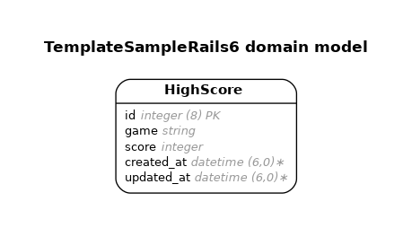

# template_sample_rails_6の解説

template_sample_rails_6の細かい内容について解説します

## Docker

Docker環境に関しては以下の記事とリポジトリを参考に作成しました。ほとんどが以下の記事を真似ているので違う箇所と説明が足りない部分だけ解説します  
まずは翻訳された記事から読むと良いでしょう（原文だとdocker-compose.ymlのバージョンが古くてハマります）

- [Ruby on Whales: Dockerizing Ruby and Rails development](https://evilmartians.com/chronicles/ruby-on-whales-docker-for-ruby-rails-development)
- [クジラに乗ったRuby: Evil Martians流Docker+Ruby/Rails開発環境構築（翻訳）](https://techracho.bpsinc.jp/hachi8833/2019_09_06/79035)
- [terraforming-rails/examples/dockerdev](https://github.com/evilmartians/terraforming-rails/tree/master/examples/dockerdev)

### Dockerfile

[Dockerfile](https://github.com/dodonki1223/template_sample_rails_6/blob/master/.dockerdev/Dockerfile)はほぼ一緒だと思います

### docker-compose.yml

[docker-compose.yml](https://github.com/dodonki1223/template_sample_rails_6/blob/master/docker-compose.yml)は変更しているので説明します  

**サービスの一覧**

サービス自体は参考した記事とリポジトリと一緒のような構成になっています

| サービス名  | 概要                                                               |
|:-----------:|:-------------------------------------------------------------------|
| rails       | Railsアプリを動かすためのサービス                                  |
| runner      | Railsと同じ環境でRailsアプリのコマンドを実行するためのサービス     |
| sidekiq     | バックグラウンドジョブを実行するためのサービス                     |
| redis       | インメモリデータベースサービス                                     |
| webpacker   | Rubyでwebpackを使用できるサービス（JavaScriptモジュールバンドラー）|
| postgres    | リレーショナルデータベースサービス                                 |

#### 共通化

[extension-fields(Version3.4からの機能)](https://docs.docker.com/compose/compose-file/#extension-fields)を使用してservicesを共通化しています

| 共通名            | 概要                                                                     |
|:-----------------:|:-------------------------------------------------------------------------|
| x-app             | Dockerfileで定義したアプリケーションコンテナの構築で必要な情報を提供する |
| x-backend-volumes | Rubyのサービスで共有するボリュームを提供する                             |
| x-backend         | Rubyのサービスで共有する振る舞いを提供する                               |

#### rails

railsサービスの実行時には以下のコマンドを実行します  
何も考えずにRailsが実行できるようにしています  

```shell
# Gemのインストール
$ bundle install
# package.json にリスト化されている全ての依存関係を node_modules 内にインストールします
$ yarn install --check-files
# DBの作成＆マイグレーションを実行
$ bin/rake db:create
$ bin/rake db:migrate
# `A server is already running` の回避
$ rm -f tmp/pids/server.pid
# Railsを実行
$ bundle exec rails server -b 0.0.0.0
```

下記コマンドに関しては初回起動時だけ必要なコマンドなので削除しても良いでしょう

```shell
$ bin/rake db:create
```

#### postgres

`bin/rake db:create` を実行すると下記のようなエラーが出ます

```
FATAL:  role "root" does not exist
Couldn't create 'test_eroge_release' database. Please check your configuration.
rake aborted!
PG::ConnectionBad: FATAL:  role "root" does not exist
```

エラーを出さないために予め `root` ユーザーを作成して置く必要があります  
下記のSQLは [postgres - Docker Hub](https://hub.docker.com/_/postgres)の `Initialization scripts` の項目を参考に起動時に実行されるように設定しています

```sql
-- rootユーザーを作成する
CREATE USER root WITH SUPERUSER;
-- root ROLEはログイン可能にする
ALTER ROLE root LOGIN;
```

#### Docker高速化

`:cached` を使用しDocker for Macでホストのディレクトリをマウントした時の遅さを回避しています  
`:cached` 設定はコンテナで実行された書き込みはホストにすぐに反映されるがホストで実行された書き込みは遅延が生じる可能性がある

詳しくは以下の記事を読むと良いでしょう

- [Performance tuning for volume mounts (shared filesystems)](https://docs.docker.com/docker-for-mac/osxfs-caching/#cached)
- [User-guided caching in Docker for Mac](https://www.docker.com/blog/user-guided-caching-in-docker-for-mac/)

```yml
x-backend-volumes: &backend-volumes
  volumes:
    - .:/app:cached
```

永続化データはホストでマウントせずに [Volumes](https://docs.docker.com/storage/volumes/) を使用することにより遅さを回避

```yml
x-backend-volumes: &backend-volumes
  volumes:
    - bundle:/bundle
    - rails_cache:/app/tmp/cache
    - node_modules:/app/node_modules
    - packs:/app/public/packs
```

## CircleCI

Workflowで使用しているJobについて解説します


### setup

setup以降のJobで使用するための資材を作成します  
このJobで作成した資材は [Workspace](https://circleci.com/docs/ja/2.0/workflows/#%E3%82%B8%E3%83%A7%E3%83%96%E9%96%93%E3%81%AE%E3%83%87%E3%83%BC%E3%82%BF%E5%85%B1%E6%9C%89%E3%82%92%E5%8F%AF%E8%83%BD%E3%81%AB%E3%81%99%E3%82%8B-workspaces-%E3%82%92%E4%BD%BF%E3%81%86) を使用してJob間でデータを共有します

### lint

以下の３つの静的コード解析を実行します

- Rubocop
- Rails Best Practices
- Brakeman

`setup` Jobが成功した時に実行されます

### test

RSpecを実行しコードカバレッジも出力します  
コードカバレッジは `ARTIFACTS` に出力されます

以下のリンクをクリックしてください


コードカバレッジを確認できます


`setup` Jobが成功した時に実行されます

### document

Rails ERDを実行しER図を出力します  

以下のリンクをクリックしてください


ER図を確認できます



`setup` Jobが成功した時に実行されます

### slack/approval-notification


Orbsの [circleci/slack@3.4.2](https://circleci.com/orbs/registry/orb/circleci/slack) を使用してSlackにCircleCIから承認通知を行います  
[circleci/slack@3.4.2](https://circleci.com/orbs/registry/orb/circleci/slack) の [approval-notification](https://circleci.com/orbs/registry/orb/circleci/slack#jobs-approval-notification) jobを使用しています  

こちらのJobは `lint`, `test` Jobが成功した時に実行されます。また `master`, `development` ブランチでしか実行されません

### approval-job


承認処理用のJobです  

- `Approve` ボタンをクリックすると後続の Jobを実行させます
- `Cancel` ボタンを押すと後続の処理を続行しません  

処理を止めたい場合はWorkflowのキャンセルを行ってください  
詳しくは [ここのドキュメント](https://circleci.com/docs/2.0/workflows/#holding-a-workflow-for-a-manual-approval) を確認してください  

こちらのJobは `slack/approval-notification` Jobが成功した時に実行されます

### deploy-heroku-development


HerokuのDevelopment環境へデプロイを実行します  
こちらのJobは `approval-job` Jobで `Approve` ボタンが押された時に実行されます。また `development` ブランチでしか実行されません

### deploy-heroku-production


HerokuのMaster環境へデプロイを実行します  
こちらのJobは `approval-job` Jobで `Approve` ボタンが押された時に実行されます。また `master` ブランチでしか実行されません
